# FFB Oil Palm Detection & Ripeness Classification - 5 Seed Experimental Results

**Generated:** 2026-01-28
**Experiments:** 7 (5 seeds each: 42, 123, 456, 789, 101)
**Training:** YOLOv11n, 100 epochs, patience=30

---

## Executive Summary

This report presents comprehensive results from 7 experiments investigating Fresh Fruit Bunch (FFB) oil palm detection and ripeness classification using various input modalities:

- **A Series (Localization):** Single-class detection (fresh_fruit_bunch) using RGB, depth, and fused RGBD inputs
- **B Series (Ripeness Classification):** Two-class detection (ripe/unripe) comparing end-to-end vs two-stage approaches

### Key Findings

| Finding | Details |
|---------|---------|
| **Best Localization** | A.1 (RGB Only) at **0.869 mAP50** |
| **Worst Localization** | A.4a (Synthetic Depth Only) at **0.708 mAP50** |
| **Real vs Synthetic** | Real depth (0.748) outperforms synthetic depth (0.708) by 5.7% |
| **RGBD Fusion** | RGB+Real Depth (A.3) underperforms RGB baseline by 3.1% |
| **Best Ripeness** | B.2 Two-Stage achieves **96.1% classification accuracy** |
| **Most Stable** | A.3 RGBD has lowest std dev (0.013) for mAP50 |
| **RGB+Synthetic Fusion** | A.4b (0.813 mAP50) underperforms RGB baseline by 6.4% |

---

## 1. Experiment A Series (Localization)

### 1.1 A.1 - RGB Only Baseline

**Description:** RGB images only (3-channel) - Baseline for all comparisons

#### Per-Seed Results

| Seed | mAP50 | mAP50-95 | Precision | Recall |
|:----:|:-----:|:--------:|:---------:|:------:|
| 42 | 0.873 | 0.393 | 0.852 | 0.752 |
| 123 | 0.855 | 0.374 | 0.862 | 0.774 |
| 456 | 0.847 | 0.364 | 0.764 | 0.790 |
| 789 | 0.880 | 0.364 | 0.836 | 0.726 |
| 101 | 0.889 | 0.388 | 0.879 | 0.781 |
| **Mean±Std** | **0.869±0.018** | **0.377±0.013** | **0.839±0.045** | **0.765±0.026** |

#### Visualizations (Seed 42)

**Confusion Matrix:**


**Precision-Recall Curve:**


**F1 Curve:**


**Training Results:**
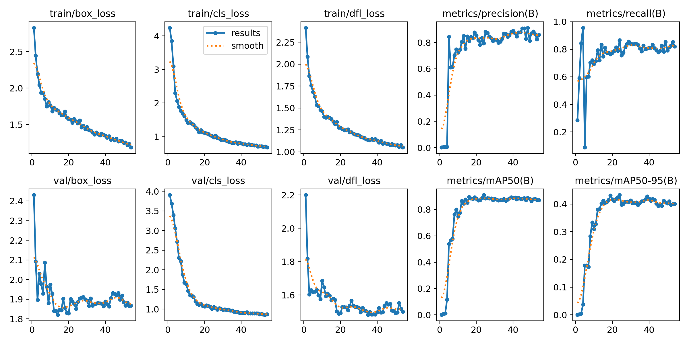

---

### 1.2 A.2 - Real Depth Only

**Description:** Real depth maps (3-channel, 0.6m-6.0m normalized from sensor)

#### Per-Seed Results

| Seed | mAP50 | mAP50-95 | Precision | Recall |
|:----:|:-----:|:--------:|:---------:|:------:|
| 42 | 0.787 | 0.291 | 0.765 | 0.774 |
| 123 | 0.728 | 0.256 | 0.770 | 0.695 |
| 456 | 0.751 | 0.278 | 0.759 | 0.721 |
| 789 | 0.779 | 0.295 | 0.725 | 0.762 |
| 101 | 0.696 | 0.259 | 0.698 | 0.676 |
| **Mean±Std** | **0.748±0.038** | **0.276±0.018** | **0.743±0.031** | **0.726±0.042** |

#### Visualizations (Seed 42)

**Confusion Matrix:**
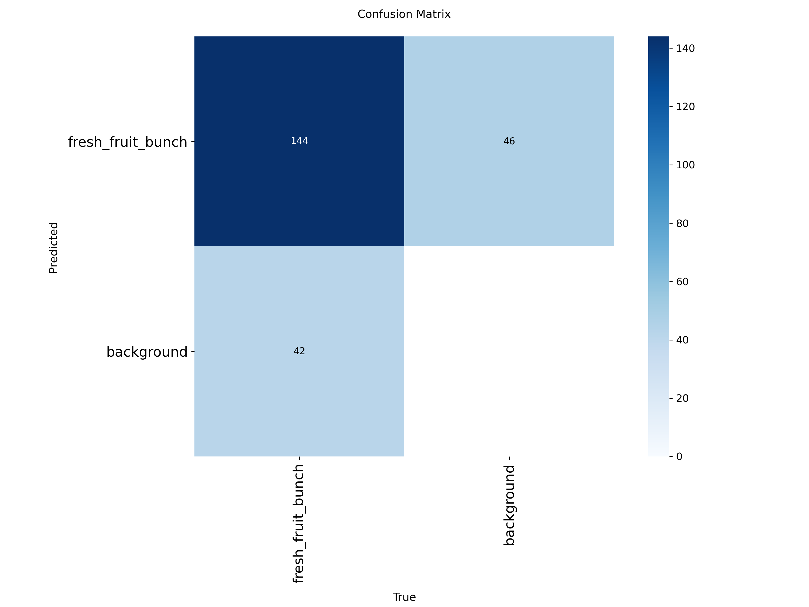

**Precision-Recall Curve:**


**F1 Curve:**


**Training Results:**
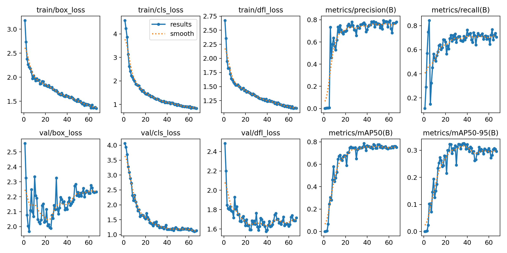

---

### 1.3 A.3 - RGB + Real Depth (4-Channel)

**Description:** RGBD fusion with real depth (4-channel images with synchronized augmentation)

> **Note:** A.3 uses `erasing=0.0` while other experiments (A.1, A.2, A.4a) use default `erasing=0.4`. This minor difference in regularization could account for ~1-2% performance variation. HSV augmentation is correctly disabled for A.3 to protect the depth channel from color corruption.

#### Per-Seed Results

| Seed | mAP50 | mAP50-95 | Precision | Recall |
|:----:|:-----:|:--------:|:---------:|:------:|
| 42 | 0.858 | 0.377 | 0.842 | 0.762 |
| 123 | 0.825 | 0.359 | 0.755 | 0.790 |
| 456 | 0.838 | 0.353 | 0.742 | 0.781 |
| 789 | 0.842 | 0.370 | 0.802 | 0.733 |
| 101 | 0.849 | 0.359 | 0.759 | 0.829 |
| **Mean±Std** | **0.842±0.013** | **0.363±0.010** | **0.780±0.041** | **0.779±0.035** |

#### Visualizations (Seed 42)

**Confusion Matrix:**
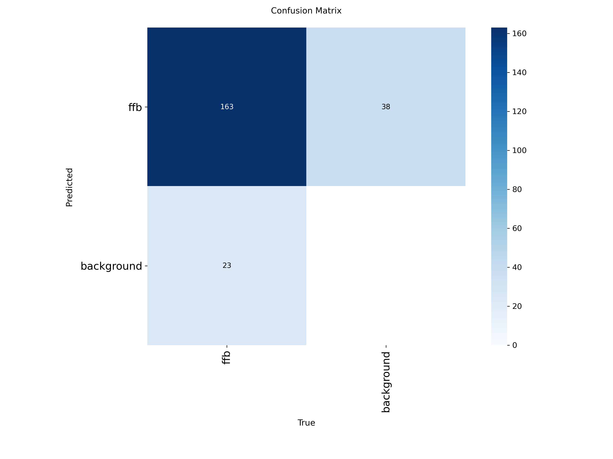

**Precision-Recall Curve:**


**F1 Curve:**


**Training Results:**
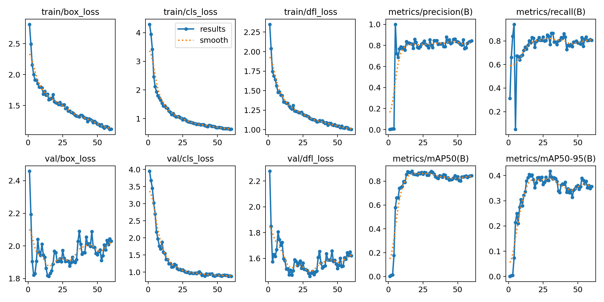

---

### 1.4 A.4a - Synthetic Depth Only

**Description:** Depth-Anything-V2 generated depth maps (3-channel, no RGB)

#### Per-Seed Results

| Seed | mAP50 | mAP50-95 | Precision | Recall |
|:----:|:-----:|:--------:|:---------:|:------:|
| 42 | 0.673 | 0.271 | 0.652 | 0.625 |
| 123 | 0.699 | 0.263 | 0.701 | 0.647 |
| 456 | 0.705 | 0.265 | 0.805 | 0.629 |
| 789 | 0.753 | 0.285 | 0.680 | 0.748 |
| 101 | 0.710 | 0.278 | 0.741 | 0.657 |
| **Mean±Std** | **0.708±0.029** | **0.273±0.009** | **0.716±0.060** | **0.661±0.050** |

#### Visualizations (Seed 42)

**Confusion Matrix:**
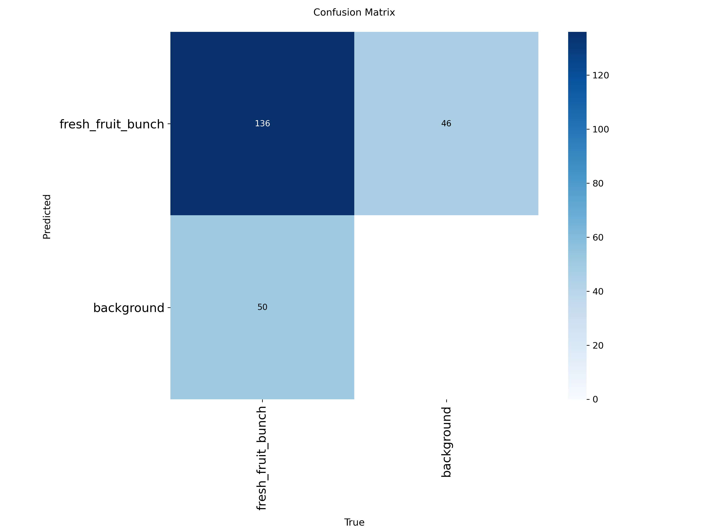

**Precision-Recall Curve:**
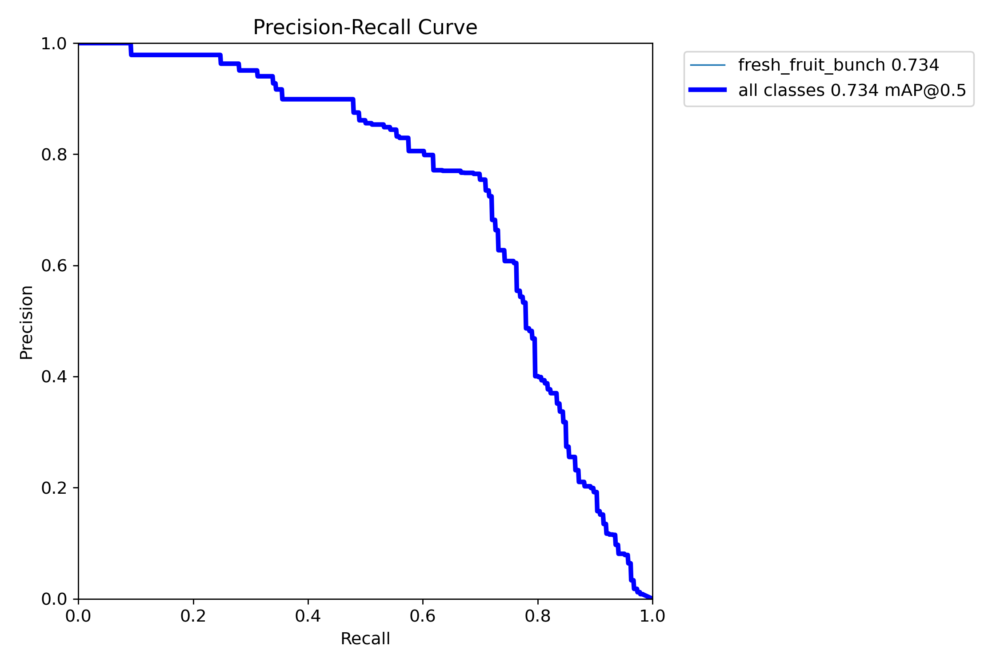

**F1 Curve:**


**Training Results:**
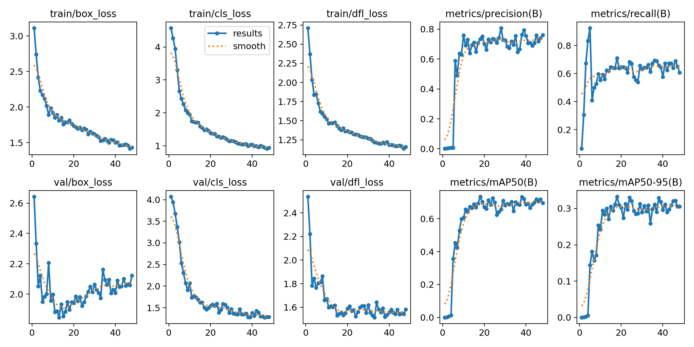

---

### 1.5 A.4b - RGB + Synthetic Depth (4-Channel)

**Description:** RGB + synthetic depth fusion (4-channel) using Depth-Anything-V2

> **Note:** A.4b uses the same augmentation settings as A.3 (`erasing=0.0`, HSV disabled) to ensure fair comparison between real and synthetic depth fusion.

#### Per-Seed Results

| Seed | mAP50 | mAP50-95 | Precision | Recall |
|:----:|:-----:|:--------:|:---------:|:------:|
| 42 | 0.830 | 0.359 | 0.826 | 0.768 |
| 123 | 0.836 | 0.375 | 0.777 | 0.762 |
| 456 | 0.801 | 0.371 | 0.806 | 0.714 |
| 789 | 0.779 | 0.337 | 0.758 | 0.686 |
| 101 | 0.820 | 0.362 | 0.758 | 0.714 |
| **Mean±Std** | **0.813±0.023** | **0.361±0.015** | **0.785±0.030** | **0.729±0.035** |

#### Visualizations (Seed 42)

**Confusion Matrix:**


**Precision-Recall Curve:**
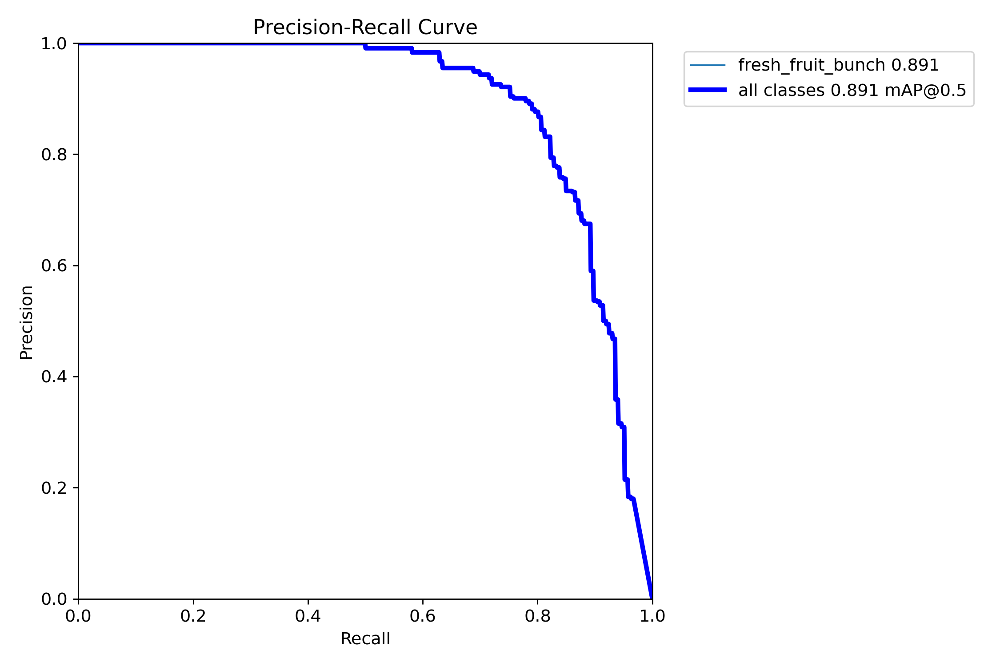

**F1 Curve:**
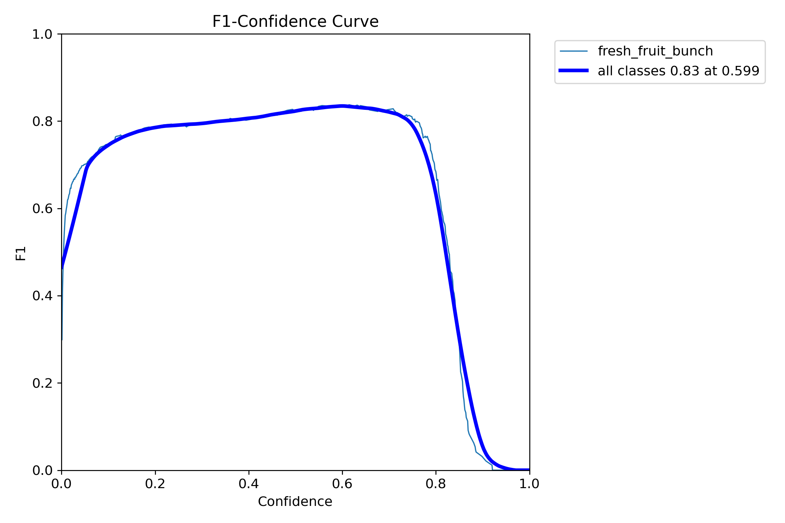

**Training Results:**
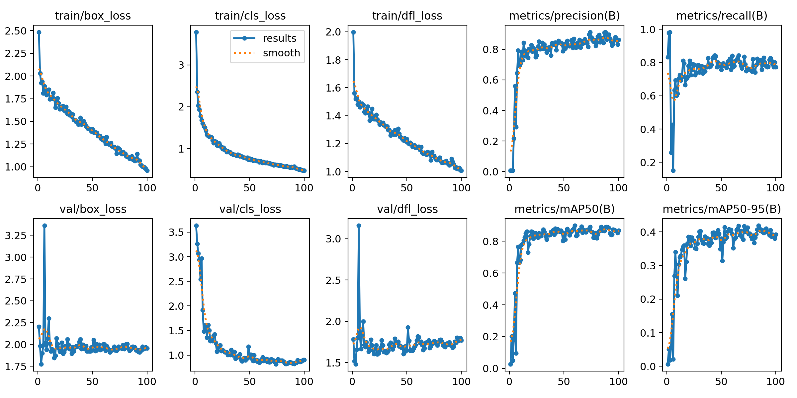

---

### 1.6 A Series Comparison

#### Summary Table

| Experiment | Input | mAP50 | mAP50-95 | Precision | Recall | Rank |
|:-----------|:------|:-----:|:--------:|:---------:|:------:|:----:|
| **A.1** | RGB Only | **0.869±0.018** | **0.377±0.013** | **0.839±0.045** | 0.765±0.026 | 1 |
| **A.3*** | RGB + Real Depth | 0.842±0.013 | 0.363±0.010 | 0.780±0.041 | **0.779±0.035** | 2 |
| **A.2** | Real Depth Only | 0.748±0.038 | 0.276±0.018 | 0.743±0.031 | 0.726±0.042 | 4 |
| **A.4b*** | RGB + Synthetic Depth | 0.813±0.023 | 0.361±0.015 | 0.785±0.030 | 0.729±0.035 | 3 |
| **A.4a** | Synthetic Depth Only | 0.708±0.029 | 0.273±0.009 | 0.716±0.060 | 0.661±0.050 | 5 |

*\*A.3 and A.4b use `erasing=0.0` and HSV disabled while A.1, A.2, A.4a use default settings. This ensures fair comparison between RGBD fusion experiments.*

#### Performance Ranking by mAP50

```
A.1 (RGB)          ████████████████████████████████████ 0.869
A.3 (RGB+Real)     ██████████████████████████████████░░ 0.842
A.4b (RGB+Syn)     █████████████████████████████████░░░ 0.813
A.2 (Real Depth)   ██████████████████████████████░░░░░░ 0.748
A.4a (Syn Depth)   ██████████████████████████░░░░░░░░░░ 0.708
                   0.70                               0.90
```

#### Key Analysis

**RGB vs Depth Performance Gap:**
- RGB (A.1) outperforms Real Depth (A.2) by **16.2%** in mAP50
- RGB (A.1) outperforms Synthetic Depth (A.4a) by **22.7%** in mAP50
- Depth-only detection is significantly more challenging

**Real vs Synthetic Depth:**
- Real Depth (A.2: 0.748) outperforms Synthetic Depth (A.4a: 0.708) by **5.7%**
- Synthetic depth alone is insufficient for reliable detection

**Fusion Effectiveness:**
- RGB+Real Depth (A.3: 0.842) **underperforms** RGB baseline (A.1: 0.869) by 3.1%
- RGB+Synthetic Depth (A.4b: 0.813) **underperforms** RGB baseline (A.1: 0.869) by 6.4%
- A.3 (real depth) outperforms A.4b (synthetic depth) by 3.6% - real depth fusion is more effective
- Overall: depth fusion does not improve over RGB alone for this dataset

---

## 2. Experiment B Series (Ripeness Classification)

### 2.1 B.1 - End-to-End Ripeness Detection

**Description:** Direct 2-class detection (ripe/unripe) - end-to-end approach

#### Per-Seed Results

| Seed | mAP50 | mAP50-95 | Precision | Recall |
|:----:|:-----:|:--------:|:---------:|:------:|
| 42 | 0.846 | 0.554 | 0.861 | 0.780 |
| 123 | 0.805 | 0.538 | 0.718 | 0.806 |
| 456 | 0.807 | 0.549 | 0.797 | 0.712 |
| 789 | 0.811 | 0.504 | 0.784 | 0.734 |
| 101 | 0.800 | 0.518 | 0.732 | 0.799 |
| **Mean±Std** | **0.814±0.018** | **0.532±0.021** | **0.779±0.057** | **0.766±0.042** |

#### Visualizations (Seed 42)

**Confusion Matrix:**
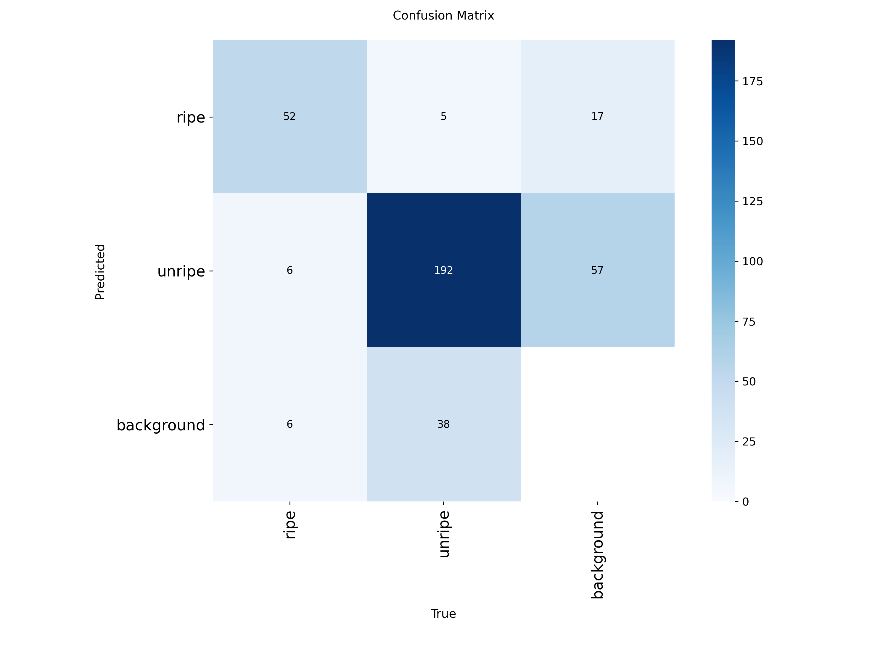

**Precision-Recall Curve:**
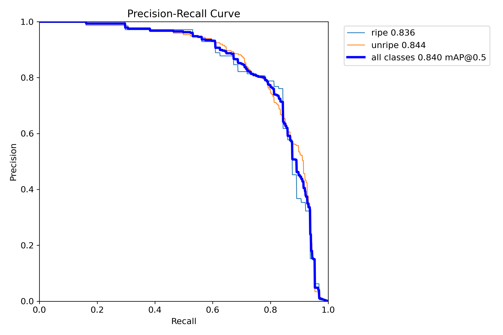

**F1 Curve:**


**Training Results:**
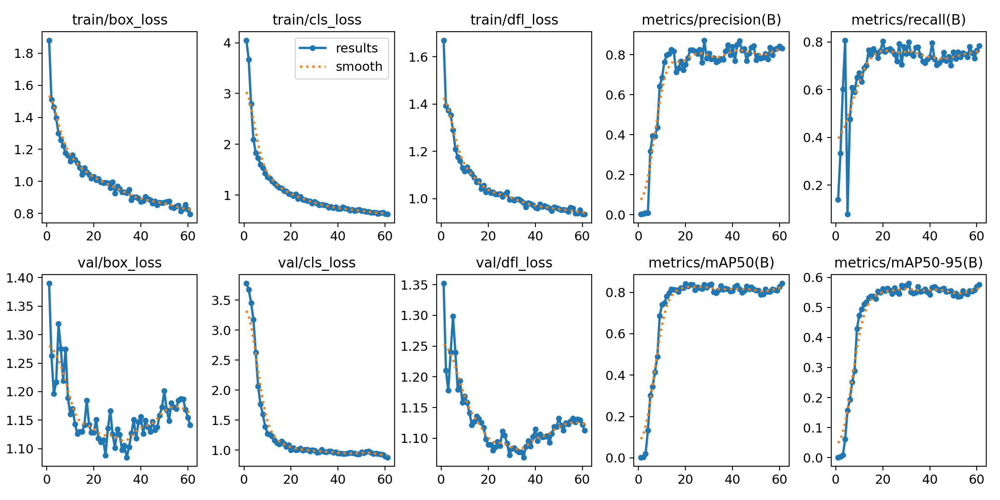

---

### 2.2 B.2 - Two-Stage Ripeness Classification

**Description:** Stage 1 (Detection) → Extract crops → Stage 2 (Classification)

#### Stage 1: Detection Results

| Seed | mAP50 | mAP50-95 | Precision | Recall |
|:----:|:-----:|:--------:|:---------:|:------:|
| 42 | 0.846 | 0.554 | 0.861 | 0.780 |
| 123 | 0.805 | 0.538 | 0.718 | 0.806 |
| 456 | 0.807 | 0.549 | 0.797 | 0.712 |
| 789 | 0.811 | 0.504 | 0.784 | 0.734 |
| 101 | 0.800 | 0.518 | 0.732 | 0.799 |
| **Mean±Std** | **0.814±0.018** | **0.532±0.021** | **0.779±0.057** | **0.766±0.042** |

*Note: Stage 1 uses same model as B.1 (end-to-end detection)*

#### Stage 2: Classification Results

| Seed | Top-1 Accuracy | Top-5 Accuracy |
|:----:|:--------------:|:--------------:|
| 42 | 0.964 | 1.000 |
| 123 | 0.971 | 1.000 |
| 456 | 0.957 | 1.000 |
| 789 | 0.957 | 1.000 |
| 101 | 0.957 | 1.000 |
| **Mean±Std** | **0.961±0.006** | **1.000±0.000** |

#### Visualizations (Seed 42)

**Stage 1 - Confusion Matrix:**


**Stage 2 - Confusion Matrix:**
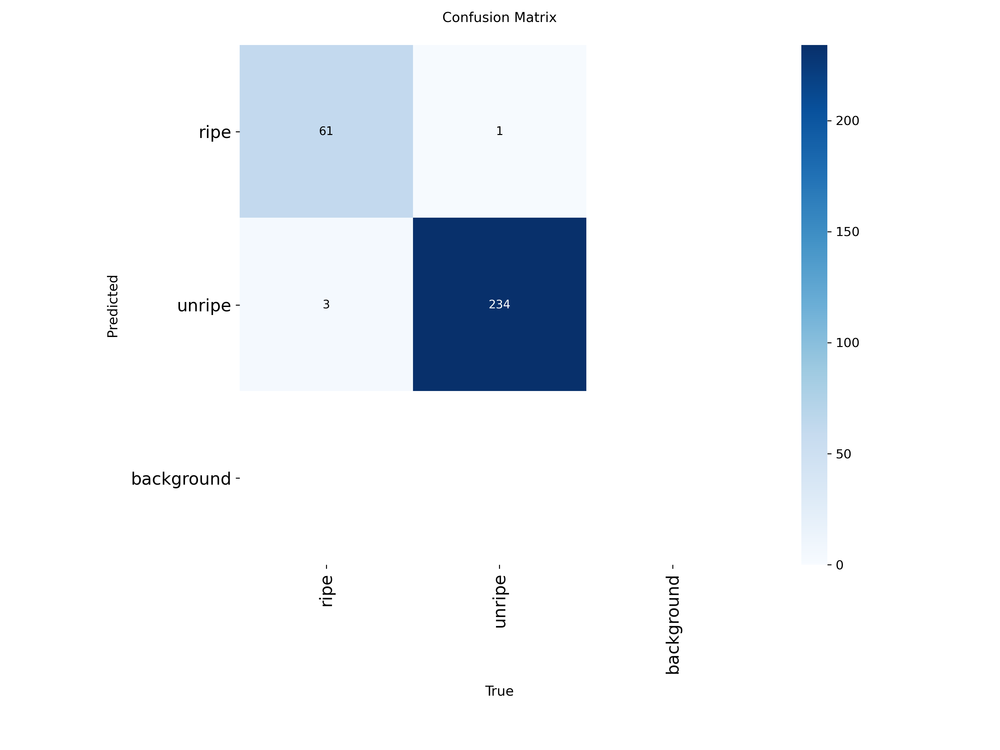

**Stage 2 - Training Results:**
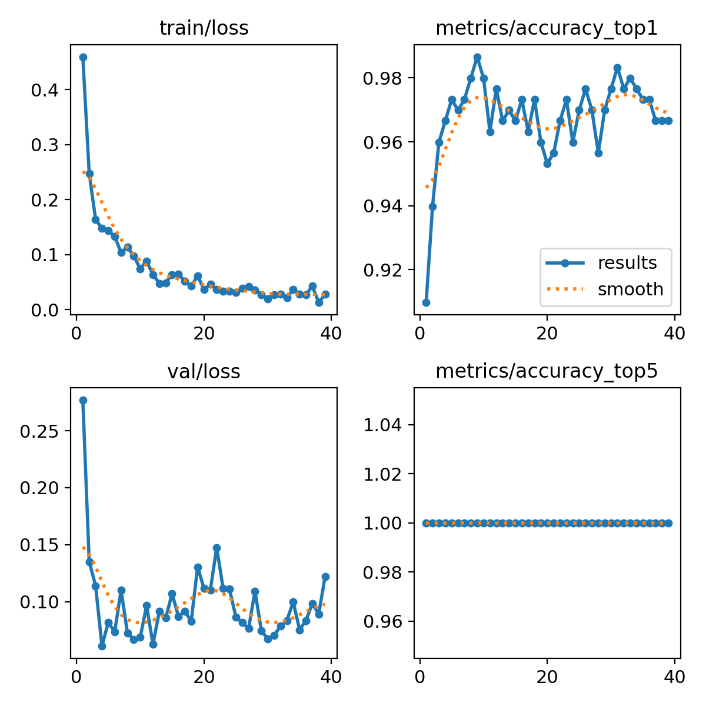

---

### 2.3 B Series Comparison

| Approach | Detection mAP50 | Classification Accuracy | Notes |
|:---------|:---------------:|:-----------------------:|:------|
| **B.1 End-to-End** | 0.814±0.018 | N/A (joint training) | Single model, simpler pipeline |
| **B.2 Two-Stage** | 0.814±0.018 | **0.961±0.006** | Specialized classifier on crops |

#### Key Insights

**Two-Stage Effectiveness:**
- Stage 2 classifier achieves **96.1% Top-1 accuracy** on cropped FFB regions
- Top-5 accuracy is **100%** across all seeds
- Standard deviation of only **0.006** indicates high stability

**Comparison:**
- Both approaches use identical Stage 1 detection (same mAP50)
- B.2 provides explicit classification confidence (96.1%)
- B.2 requires crop extraction but yields interpretable classification results

**Recommendation:**
- Use **B.2 Two-Stage** for applications requiring high classification accuracy
- Use **B.1 End-to-End** for simpler deployment with acceptable performance

---

## 3. Detailed Analysis

### 3.1 Seed Variability Analysis

#### Standard Deviation Comparison (mAP50)

| Experiment | Std Dev | Stability Rating |
|:-----------|:-------:|:----------------:|
| A.3 RGB+Real Depth | 0.013 | Most Stable |
| A.1 RGB Only | 0.018 | Very Stable |
| B.1/B.2 Detection | 0.018 | Very Stable |
| A.4b RGB+Synthetic | 0.023 | Stable |
| A.4a Synthetic Depth | 0.029 | Moderate |
| A.2 Real Depth | 0.038 | Least Stable |

**Observations:**
- RGB-based methods show lower variance across seeds
- Depth-only methods exhibit higher sensitivity to initialization
- A.3 (RGBD) is surprisingly the most stable despite lower mean performance

### 3.2 Input Modality Comparison

#### Performance by Input Type

| Input Type | Best Experiment | mAP50 | vs RGB Baseline |
|:-----------|:----------------|:-----:|:---------------:|
| RGB Only | A.1 | 0.869 | - |
| RGB + Real Depth | A.3 | 0.842 | -3.1% |
| RGB + Synthetic Depth | A.4b | 0.813 | -6.4% |
| Real Depth Only | A.2 | 0.748 | -13.9% |
| Synthetic Depth Only | A.4a | 0.708 | -18.5% |

#### Key Findings

1. **RGB is King:** RGB-only achieves best performance with simplest setup
2. **RGBD Fusion Underperforms:** Adding depth (real or synthetic) to RGB reduces performance
3. **Real > Synthetic Fusion:** A.3 (real depth, 0.842) outperforms A.4b (synthetic, 0.813) by 3.6%
4. **Depth Alone Insufficient:** Both real and synthetic depth-only perform significantly worse

### 3.3 Per-Seed Complete Breakdown

#### All Experiments - Seed 42

| Experiment | mAP50 | mAP50-95 | Precision | Recall |
|:-----------|:-----:|:--------:|:---------:|:------:|
| A.1 RGB | **0.873** | **0.393** | 0.852 | 0.752 |
| A.2 Real Depth | 0.787 | 0.291 | 0.765 | **0.774** |
| A.3 RGB+Real | 0.858 | 0.377 | **0.842** | 0.762 |
| A.4a Synthetic | 0.673 | 0.271 | 0.652 | 0.625 |
| A.4b RGB+Syn | 0.830 | 0.359 | 0.826 | 0.768 |
| B.1 Ripeness | 0.846 | 0.554 | 0.861 | 0.780 |
| B.2 Detection | 0.846 | 0.554 | 0.861 | 0.780 |

#### All Experiments - Seed 123

| Experiment | mAP50 | mAP50-95 | Precision | Recall |
|:-----------|:-----:|:--------:|:---------:|:------:|
| A.1 RGB | 0.855 | 0.374 | **0.862** | 0.774 |
| A.2 Real Depth | 0.728 | 0.256 | 0.770 | 0.695 |
| A.3 RGB+Real | 0.825 | 0.359 | 0.755 | **0.790** |
| A.4a Synthetic | 0.699 | 0.263 | 0.701 | 0.647 |
| A.4b RGB+Syn | 0.836 | 0.375 | 0.777 | 0.762 |
| B.1 Ripeness | 0.805 | 0.538 | 0.718 | **0.806** |
| B.2 Detection | 0.805 | 0.538 | 0.718 | **0.806** |

---

## 4. Visualizations Gallery

### 4.1 Training Curves Comparison

#### A Series Results Comparison

| A.1 RGB | A.2 Real Depth | A.3 RGB+Real |
|:-------:|:--------------:|:------------:|
|  |  |  |

| A.4a Synthetic | A.4b RGB+Synthetic |
|:--------------:|:------------------:|
|  |  |

### 4.2 Confusion Matrices Comparison

#### A Series Confusion Matrices

| Experiment | Confusion Matrix |
|:-----------|:----------------:|
| A.1 RGB |  |
| A.2 Real Depth |  |
| A.3 RGB+Real |  |
| A.4a Synthetic |  |
| A.4b RGB+Syn |  |

#### B Series Confusion Matrices

| Experiment | Confusion Matrix |
|:-----------|:----------------:|
| B.1 End-to-End |  |
| B.2 Stage 1 (Detect) |  |
| B.2 Stage 2 (Classify) |  |

### 4.3 PR Curves Comparison

#### A Series PR Curves

| A.1 RGB | A.2 Real Depth | A.3 RGB+Real |
|:-------:|:--------------:|:------------:|
|  |  |  |

| A.4a Synthetic | A.4b RGB+Synthetic |
|:--------------:|:------------------:|
|  |  |

---

## 5. Key Findings & Conclusions

### 5.1 Main Results Summary

| Metric | Best Value | Experiment |
|:-------|:----------:|:-----------|
| **Localization mAP50** | 0.869 | A.1 (RGB Only) |
| **Localization mAP50-95** | 0.377 | A.1 (RGB Only) |
| **Depth-only mAP50** | 0.748 | A.2 (Real Depth) |
| **Ripeness Detection mAP50** | 0.814 | B.1 & B.2 Stage 1 |
| **Classification Accuracy** | 96.1% | B.2 Stage 2 |
| **Most Stable (lowest std)** | 0.013 | A.3 (RGB+Real) |
| **RGB+Synthetic Fusion** | 0.813 | A.4b |

### 5.2 Key Insights

#### Localization (A Series)

1. **RGB is Optimal:** RGB-only detection achieves the best mAP50 (0.869) with the simplest setup
2. **RGBD Fusion Underperforms:** Adding real depth (A.3: 0.842, -3.1%) or synthetic depth (A.4b: 0.813, -6.4%) reduces performance
3. **Real > Synthetic Fusion:** A.3 (real depth) outperforms A.4b (synthetic depth) by 3.6%
4. **Depth Alone Insufficient:** Both real (0.748) and synthetic (0.708) depth-only underperform significantly
5. **Real > Synthetic Depth-Only:** Real depth (A.2) outperforms synthetic depth (A.4a) by 5.7%

#### Ripeness Classification (B Series)

1. **Two-Stage Highly Effective:** B.2 achieves 96.1% classification accuracy with 100% top-5 accuracy
2. **Stable Performance:** Classification shows very low variance (std=0.006) across seeds
3. **Equivalent Detection:** Both B.1 and B.2 Stage 1 achieve identical detection performance

### 5.3 Recommendations

#### For Deployment

| Scenario | Recommended Approach | Rationale |
|:---------|:---------------------|:----------|
| **Simple Localization** | A.1 RGB Only | Best performance, simplest setup |
| **No RGB Camera Available** | A.2 Real Depth | Best depth-only option |
| **Ripeness Classification** | B.2 Two-Stage | 96.1% accuracy, interpretable |
| **Resource Constrained** | A.1 RGB Only | Single modality, less computation |
| **Depth Sensor Available** | A.1 RGB Only | Depth doesn't improve RGB detection |

#### For Future Research

1. **Investigate RGBD Fusion:** Current fusion approach may need refinement - depth information may not be properly utilized
2. **Synthetic Depth Quality:** Depth-Anything-V2 produces usable depth when combined with RGB but insufficient alone
3. **Multi-Scale Detection:** Consider feature pyramid improvements for depth-only detection
4. **Attention Mechanisms:** Explore attention-based fusion for better RGBD integration

### 5.4 Dataset-Specific Observations

- **RGB Sufficiency:** The FFB dataset has strong visual (RGB) features that make depth less critical
- **Depth Value:** Depth may provide value in scenarios with lighting variations (not tested)
- **Synthetic Viability:** Depth-Anything-V2 is viable for generating training depth when real sensors unavailable

---

## Appendix A: Raw Data Files

All raw result files are available in their respective experiment directories:

| Experiment | Results File | Status |
|:-----------|:-------------|:-------|
| A.1 RGB | `train_a1_rgb/kaggleoutput/a1_rgb_results.txt` | Valid |
| A.2 Real Depth | `train-a2-depth/kaggleoutput/a2_depth_results.txt` | Valid |
| A.3 RGB+Real | `train-a3-rgbd/kaggleoutput/a3_rgbd_results.txt` | Valid |
| A.4a Synthetic | `train-a4a-synthetic-depth/kaggleoutput/a4a_synthetic_depth_results.txt` | Valid |
| A.4b RGB+Syn | `train-a4b-rgbd-synthetic/kaggleoutput/a4b_rgbd_synthetic_results.txt` | Valid |
| B.1 Ripeness | `train-b1-ripeness/kaggleoutput/b1_ripeness_results.txt` | Valid |
| B.2 Two-Stage | `train-b2-twostage/kaggleoutput/b2_twostage_results.txt` | Valid |

## Appendix B: Model Weights

Best model weights for each seed are stored in:
```
<experiment_dir>/runs/detect/exp_<name>_seed<NN>/weights/best.pt
```

Example:
```
train_a1_rgb/runs/detect/exp_a1_rgb_seed42/weights/best.pt
train-b2-twostage/runs/classify/exp_b2_stage2_seed42/weights/best.pt
```

---

*Report generated from 5-seed experimental results (seeds: 42, 123, 456, 789, 101)*
