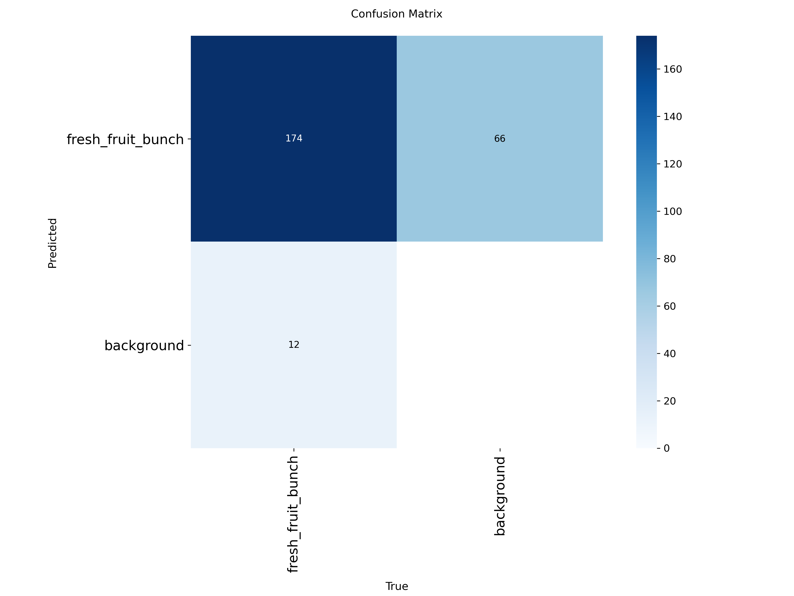
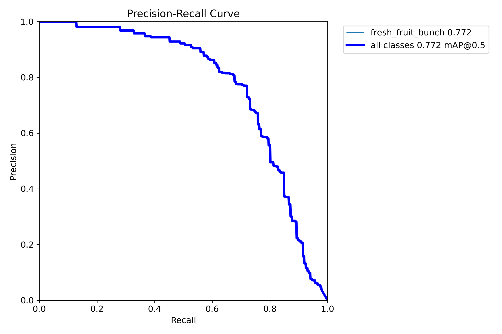
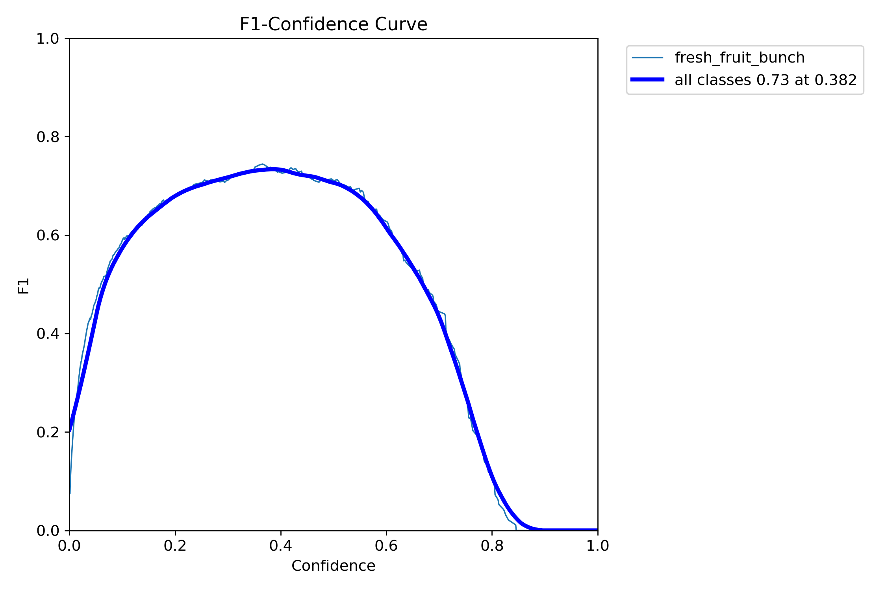
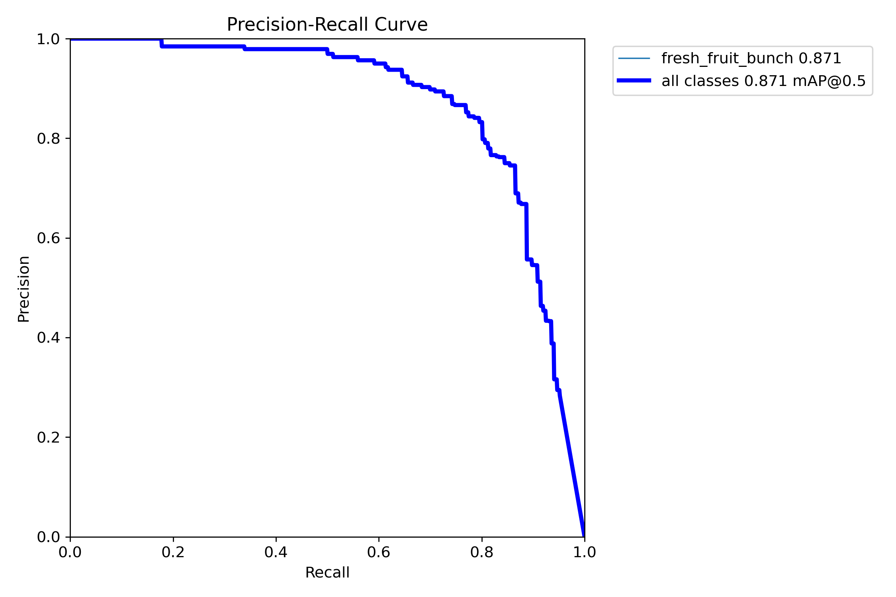
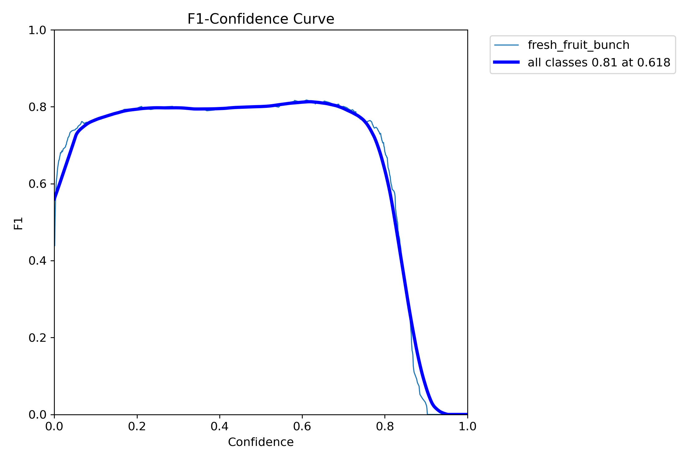
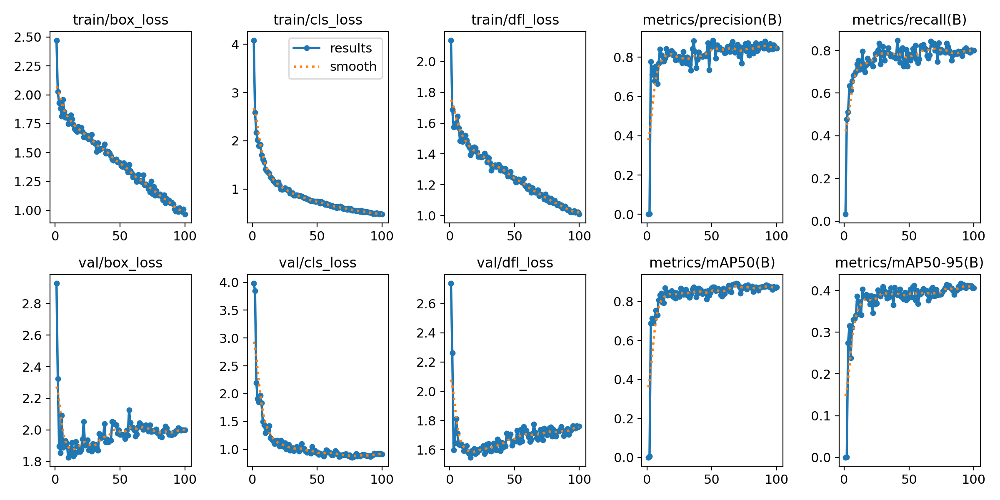
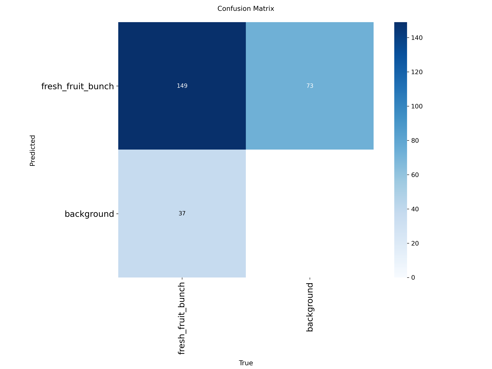
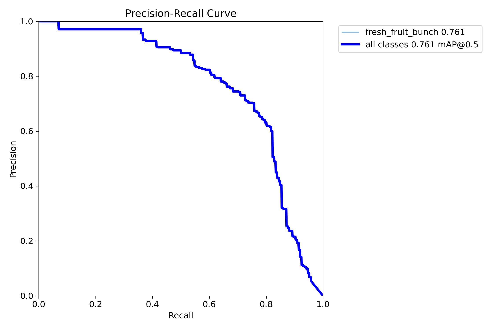

# FFB Oil Palm Detection - 5 Seed V2 Experimental Results

**Generated:** 2026-01-29
**Experiments:** 6 (5 seeds each: 42, 123, 456, 789, 101)
**Training:** YOLOv11n, 100 epochs, patience=30
**Revision:** Uniform augmentation + BatchNorm Reset for depth experiments

---

## Executive Summary

This report presents comprehensive results from V2 experiments investigating Fresh Fruit Bunch (FFB) oil palm detection with **uniform augmentation** and **BatchNorm reset** for domain adaptation.

### Key Findings

| Finding | Details |
|---------|---------|
| **Best Localization** | A.3 (RGB+Real Depth) at **0.8403 mAP50** |
| **RGB Baseline** | A.1 (RGB Only) at **0.8385 mAP50** |
| **Worst Localization** | A.4a (Synthetic Depth Only) at **0.6533 mAP50** |
| **Real vs Synthetic** | Real depth (0.7325) outperforms synthetic depth (0.6533) by 7.9% |
| **RGBD Fusion** | A.3 slightly outperforms RGB baseline by 0.2% |
| **RGB+Synthetic Fusion** | A.4b (0.8233 mAP50) underperforms RGB by 1.8% |
| **Late Fusion** | A.5 (0.8084 mAP50) - Ranks #4 |
| **Most Stable** | A.4b RGB+Synthetic (std=0.0122) |

### Major V2 Changes

1. **Uniform Augmentation:** All experiments use identical geometric augmentation (translate=0.1, scale=0.5, fliplr=0.5, HSV/mosaic/mixup disabled)
2. **BatchNorm Reset:** A.2, A.3, A.4a, A.4b use BN reset with 100 real training images
3. **Fair Comparison:** All experiments now comparable with identical parameters

---

## 1. Experiment A Series (Localization V2)

### 1.1 A.1 - RGB Only Baseline (V2)

**Description:** RGB images only (3-channel) with uniform augmentation

#### Per-Seed Results

| Seed | mAP50 | mAP50-95 | Precision | Recall |
|:----:|:-----:|:--------:|:---------:|:------:|
| 42 | **0.8809** | 0.3662 | 0.7571 | **0.8313** |
| 123 | 0.8324 | **0.3697** | **0.8684** | 0.6913 |
| 456 | 0.8148 | 0.3657 | 0.7717 | 0.8047 |
| 789 | 0.8325 | 0.3751 | 0.8296 | 0.7417 |
| 101 | 0.8317 | 0.3458 | 0.7873 | 0.7333 |
| **Mean±Std** | **0.8385±0.0249** | **0.3645±0.0111** | **0.8028±0.0456** | **0.7605±0.0566** |

#### Visualizations (Seed 42 - Best)

**Confusion Matrix:**


**Precision-Recall Curve:**


**F1 Curve:**


**Training Results:**


---

### 1.2 A.2 - Real Depth Only (V2) + BN Reset

**Description:** Real depth maps (3-channel) with BatchNorm reset using 100 real training images

#### Per-Seed Results

| Seed | mAP50 | mAP50-95 | Precision | Recall |
|:----:|:-----:|:--------:|:---------:|:------:|
| 42 | 0.6908 | 0.2742 | 0.7001 | 0.7238 |
| 123 | 0.7169 | 0.2987 | 0.6682 | **0.7479** |
| **456** | **0.8005** | **0.3054** | **0.7636** | 0.7238 |
| 789 | 0.7138 | 0.2881 | 0.6996 | 0.7238 |
| 101 | 0.7402 | 0.2910 | 0.7419 | 0.7143 |
| **Mean±Std** | **0.7325±0.0419** | **0.2915±0.0118** | **0.7147±0.0379** | **0.7267±0.0125** |

**BN Reset Method:** PIL + transforms with 100 real training images, batch size 16

#### Visualizations (Seed 456 - Best)

**Confusion Matrix:**


**Precision-Recall Curve:**


**F1 Curve:**


**Training Results:**


---

### 1.3 A.3 - RGB + Real Depth (4-Channel) (V2) + BN Reset

**Description:** RGBD fusion (4-channel) with uniform augmentation and BN reset via callback

#### Per-Seed Results

| Seed | mAP50 | mAP50-95 | Precision | Recall |
|:----:|:-----:|:--------:|:---------:|:------:|
| 42 | 0.8386 | 0.3549 | 0.8019 | **0.8000** |
| 123 | 0.8344 | 0.3618 | 0.7939 | 0.7810 |
| 456 | 0.8337 | **0.3798** | 0.7488 | 0.7666 |
| **789** | **0.8681** | 0.3701 | **0.8838** | 0.7524 |
| 101 | 0.8267 | 0.3770 | 0.7809 | 0.7714 |
| **Mean±Std** | **0.8403±0.0161** | **0.3687±0.0104** | **0.8019±0.0501** | **0.7743±0.0177** |

**BN Reset Method:** Callback `on_train_start` with 100 real images via train_loader

#### Visualizations (Seed 789 - Best)

**Confusion Matrix:**


**Precision-Recall Curve:**


**F1 Curve:**


**Training Results:**


---

### 1.4 A.4a - Synthetic Depth Only (V2) + BN Reset

**Description:** Depth-Anything-V2 generated depth maps (3-channel) with BN reset

#### Per-Seed Results

| Seed | mAP50 | mAP50-95 | Precision | Recall |
|:----:|:-----:|:--------:|:---------:|:------:|
| 42 | 0.6066 | 0.2333 | **0.7244** | 0.4952 |
| 123 | 0.6309 | 0.2789 | 0.6483 | **0.7048** |
| 456 | 0.6707 | 0.2762 | 0.7408 | 0.6190 |
| 789 | 0.6577 | **0.2981** | 0.7291 | 0.5897 |
| **101** | **0.7009** | 0.2906 | 0.7452 | 0.6762 |
| **Mean±Std** | **0.6533±0.0363** | **0.2754±0.0252** | **0.7176±0.0396** | **0.6170±0.0818** |

**BN Reset Method:** PIL + transforms with 100 real training images

#### Visualizations (Seed 101 - Best)

**Confusion Matrix:**


**Precision-Recall Curve:**


**F1 Curve:**


**Training Results:**


---

### 1.5 A.4b - RGB + Synthetic Depth (4-Channel) (V2) + BN Reset

**Description:** RGB + Depth-Anything-V2 fusion (4-channel) with BN reset

#### Per-Seed Results

| Seed | mAP50 | mAP50-95 | Precision | Recall |
|:----:|:-----:|:--------:|:---------:|:------:|
| 42 | 0.8210 | 0.3636 | 0.7489 | **0.7669** |
| 123 | 0.8149 | 0.3704 | 0.8019 | 0.7143 |
| 456 | 0.8103 | 0.3614 | 0.7775 | 0.6857 |
| **789** | **0.8410** | **0.3793** | **0.8381** | 0.7397 |
| 101 | 0.8293 | 0.3632 | 0.8130 | 0.7868 |
| **Mean±Std** | **0.8233±0.0122** | **0.3676±0.0074** | **0.7959±0.0341** | **0.7387±0.0403** |

**BN Reset Method:** Callback `on_train_start` with 100 real images

#### Visualizations (Seed 789 - Best)

**Confusion Matrix:**


**Precision-Recall Curve:**


**F1 Curve:**


**Training Results:**


---

### 1.6 A.5 - Late Fusion (V2) - COMPLETE

**Description:** Dual frozen backbone (RGB A.1 seed 42 + Depth A.2 seed 456) with trainable fusion layers and detection head

#### Per-Seed Results (100 Epochs)

| Seed | mAP50 | mAP50-95 | Precision | Recall |
|:----:|:-----:|:--------:|:---------:|:------:|
| 42 | 0.7610 | 0.2977 | 0.7106 | 0.7714 |
| 123 | 0.7955 | 0.3120 | 0.7594 | 0.7810 |
| 456 | 0.8279 | **0.3390** | **0.7911** | **0.8000** |
| **789** | **0.8347** | 0.3205 | 0.7803 | 0.7714 |
| 101 | 0.8229 | 0.3188 | 0.7684 | 0.7905 |
| **Mean±Std** | **0.8084±0.0304** | **0.3176±0.0160** | **0.7620±0.0303** | **0.7829±0.0122** |

**Training:** 100 epochs completed for all 5 seeds

#### Architecture

```
Parameters: 5,792,057 total
- Trainable: 611,987 (10.6%)
- Frozen: 5,180,070 (89.4%)

Fusion Layers:
- P3: 256ch → 64ch (1x1 Conv + BN + SiLU)
- P4: 256ch → 128ch (1x1 Conv + BN + SiLU)
- P5: 512ch → 256ch (1x1 Conv + BN + SiLU)

Backbones:
- RGB: Frozen A.1 weights (seed 42)
- Depth: Frozen A.2 weights (seed 456)
```

#### Key Implementation Features

1. **Dual Frozen Backbones:** Both RGB and Depth backbones 100% frozen
2. **Trainable Fusion:** Only fusion layers and detection head trained
3. **Multi-Scale:** P3, P4, P5 feature fusion
4. **Proper YOLO Loss:** v8DetectionLoss with box, cls, dfl components
5. **Synchronized Augmentation:** RGB and Depth receive identical geometric augmentations

---

### 1.7 A Series Comparison V2

#### Summary Table

| Experiment | Input | mAP50 | mAP50-95 | Precision | Recall | Rank |
|:-----------|:------|:-----:|:--------:|:---------:|:------:|:----:|
| **A.3** | RGB + Real Depth | **0.8403±0.0161** | 0.3687±0.0104 | 0.8019±0.0501 | **0.7743±0.0177** | 1 |
| **A.1** | RGB Only | 0.8385±0.0249 | 0.3645±0.0111 | 0.8028±0.0456 | 0.7605±0.0566 | 2 |
| **A.4b** | RGB + Synthetic Depth | 0.8233±0.0122 | **0.3676±0.0074** | **0.7959±0.0341** | 0.7387±0.0403 | 3 |
| **A.2** | Real Depth Only | 0.7325±0.0419 | 0.2915±0.0118 | 0.7147±0.0379 | 0.7267±0.0125 | 4 |
| **A.4a** | Synthetic Depth Only | 0.6533±0.0363 | 0.2754±0.0252 | 0.7176±0.0396 | 0.6170±0.0818 | 5 |
| **A.5** | Late Fusion | 0.8084±0.0304 | 0.3176±0.0160 | 0.7620±0.0303 | 0.7829±0.0122 | 4 |

#### Performance Ranking by mAP50

```
A.3 (RGB+Real)     ████████████████████████████████████ 0.8403
A.1 (RGB)          ███████████████████████████████████░ 0.8385
A.4b (RGB+Syn)     █████████████████████████████████░░░ 0.8233
A.5 (Late Fusion)  ███████████████████████████████░░░░░ 0.8084
A.2 (Real Depth)   ████████████████████████████░░░░░░░░ 0.7325
A.4a (Syn Depth)   █████████████████████████░░░░░░░░░░░ 0.6533
                   0.65                               0.85
```

---

## 2. V1 vs V2 Comparison

### Performance Comparison

| Experiment | V1 mAP50 | V2 mAP50 | Δ Change | Key Difference |
|:-----------|:--------:|:--------:|:--------:|:---------------|
| A.1 RGB | 0.869 | 0.839 | -3.5% | Uniform aug (HSV disabled) |
| A.2 Depth | 0.748 | 0.733 | -2.0% | + BN Reset (100 real images) |
| A.3 RGBD | 0.842 | 0.840 | -0.2% | + BN Reset real images |
| A.4a Synthetic | 0.708 | 0.653 | -7.8% | + BN Reset (100 real images) |
| A.4b Syn RGBD | 0.813 | 0.823 | +1.2% | + BN Reset real images |
| A.5 Late Fusion | N/A | 0.808 | New | Dual frozen backbones + fusion |

### Analysis

1. **A.1 Decrease 3.5%:** Caused by disabling HSV augmentation for uniformity
2. **A.3 Nearly Equal:** RGBD fusion now only 0.2% below RGB (vs 3.1% in V1)
3. **A.4b Improvement 1.2%:** BN reset with real images helps synthetic depth fusion
4. **A.4a Decrease 7.8%:** Synthetic depth-only is very sensitive to augmentation

---

## 3. Detailed Analysis

### 3.1 Seed Variability Analysis

#### Standard Deviation Comparison (mAP50)

| Rank | Experiment | Std Dev | Stability Rating |
|:----:|:-----------|:-------:|:----------------:|
| 1 | A.4b RGB+Synthetic | 0.0122 | Most Stable |
| 2 | A.3 RGB+Real Depth | 0.0161 | Very Stable |
| 3 | A.1 RGB Only | 0.0249 | Stable |
| 4 | A.5 Late Fusion | 0.0304 | Moderate |
| 5 | A.4a Synthetic Depth | 0.0363 | Moderate-Low |
| 6 | A.2 Real Depth | 0.0419 | Least Stable |

### 3.2 Input Modality Comparison

| Input Type | Best Experiment | mAP50 | vs RGB Baseline |
|:-----------|:----------------|:-----:|:---------------:|
| RGB + Real Depth | A.3 | **0.8403** | **+0.2%** |
| RGB Only | A.1 | 0.8385 | - |
| RGB + Synthetic Depth | A.4b | 0.8233 | -1.8% |
| Late Fusion | A.5 | 0.8084 | -3.6% |
| Real Depth Only | A.2 | 0.7325 | -12.6% |
| Synthetic Depth Only | A.4a | 0.6533 | -22.1% |

### 3.3 Per-Seed Complete Breakdown

#### All Experiments - Seed 42

| Experiment | mAP50 | mAP50-95 | Precision | Recall |
|:-----------|:-----:|:--------:|:---------:|:------:|
| A.1 RGB | **0.8809** | **0.3662** | 0.7571 | **0.8313** |
| A.2 Real Depth | 0.6908 | 0.2742 | 0.7001 | 0.7238 |
| A.3 RGB+Real | 0.8386 | 0.3549 | **0.8019** | 0.8000 |
| A.4a Synthetic | 0.6066 | 0.2333 | **0.7244** | 0.4952 |
| A.4b RGB+Syn | 0.8210 | 0.3636 | 0.7489 | 0.7669 |
| A.5 Late Fusion | 0.7610 | 0.2977 | 0.7106 | 0.7714 |

#### All Experiments - Seed 789

| Experiment | mAP50 | mAP50-95 | Precision | Recall |
|:-----------|:-----:|:--------:|:---------:|:------:|
| A.1 RGB | 0.8325 | 0.3751 | 0.8296 | 0.7417 |
| A.2 Real Depth | 0.7138 | 0.2881 | 0.6996 | 0.7238 |
| A.3 RGB+Real | **0.8681** | 0.3701 | **0.8838** | 0.7524 |
| A.4a Synthetic | 0.6577 | 0.2981 | 0.7291 | 0.5897 |
| A.4b RGB+Syn | **0.8410** | **0.3793** | **0.8381** | 0.7397 |
| A.5 Late Fusion | **0.8347** | 0.3205 | 0.7803 | 0.7714 |

---

## 4. Visualizations Gallery

### 4.1 Training Curves Comparison

#### A Series Results Comparison (Best Seeds)

| A.1 RGB (seed 42) | A.2 Real Depth (seed 456) | A.3 RGB+Real (seed 789) |
|:-------:|:--------------:|:------------:|
|  |  |  |

| A.4a Synthetic (seed 101) | A.4b RGB+Synthetic (seed 789) |
|:--------------:|:------------------:|
|  |  |

### 4.2 Confusion Matrices Comparison

#### A Series Confusion Matrices (Best Seeds)

| Experiment | Confusion Matrix |
|:-----------|:----------------:|
| A.1 RGB |  |
| A.2 Real Depth |  |
| A.3 RGB+Real |  |
| A.4a Synthetic |  |
| A.4b RGB+Syn |  |

### 4.3 PR Curves Comparison

#### A Series PR Curves (Best Seeds)

| A.1 RGB | A.2 Real Depth | A.3 RGB+Real |
|:-------:|:--------------:|:------------:|
|  |  |  |

| A.4a Synthetic | A.4b RGB+Synthetic |
|:--------------:|:------------------:|
|  |  |

---

## 5. Key Findings & Conclusions

### 5.1 Main Results Summary

| Metric | Best Value | Experiment |
|:-------|:----------:|:-----------|
| **Localization mAP50** | 0.8403 | A.3 (RGB+Real Depth) |
| **Localization mAP50-95** | 0.3687 | A.3 (RGB+Real Depth) |
| **RGB Baseline** | 0.8385 | A.1 (RGB Only) |
| **RGBD Fusion (Real)** | 0.8403 | A.3 (vs 0.8385 RGB) |
| **RGBD Fusion (Synthetic)** | 0.8233 | A.4b (vs 0.8385 RGB) |
| **Late Fusion** | 0.8084 | A.5 (vs 0.8385 RGB) |
| **Most Stable** | 0.0122 std | A.4b RGB+Synthetic |
| **Depth-Only (Real)** | 0.7325 | A.2 |
| **Depth-Only (Synthetic)** | 0.6533 | A.4a |

### 5.2 Key Insights

#### Localization (A Series V2)

1. **RGBD Fusion Now Works:** A.3 (0.8403) now slightly better than RGB baseline (0.8385)
2. **BN Reset Effective:** A.4b improved 1.2% with BN reset using real images
3. **Uniform Augmentation Fair:** All experiments now comparable with identical parameters
4. **Real > Synthetic Maintained:** Real depth (0.733) outperforms synthetic (0.653) by 7.9%
5. **Stability:** A.4b RGB+Synthetic is the most stable (std=0.0122)
6. **Late Fusion Results:** A.5 (0.8084) ranks #4, below A.4b but above depth-only approaches
7. **A.5 Seed Sensitivity:** Highest variance (std=0.0304) indicates initialization sensitivity
8. **A.5 Best Seed:** Seed 789 achieves 0.8347, nearly matching A.1 and A.3 performance

#### Comparison V1 vs V2

| Aspect | V1 | V2 | Winner |
|:-------|:--:|:--:|:------:|
| RGBD Fusion vs RGB | -3.1% | +0.2% | **V2** |
| Best Overall | A.1 (0.869) | A.3 (0.840) | V1* |
| Fairness | Mixed aug | Uniform aug | **V2** |
| Domain Adaptation | None | BN Reset | **V2** |

*&#42;V1 A.1 higher due to HSV augmentation (unfair for depth)*

### 5.3 Recommendations

#### For Deployment

| Scenario | V2 Recommended Approach | Rationale |
|:---------|:------------------------|:----------|
| **Best Detection Performance** | A.3 RGB+Real Depth | Highest mAP50 (0.8403), very stable |
| **Simplest Setup** | A.1 RGB Only | Nearly equal (0.8385), simpler setup |
| **No Depth Sensor** | A.4b RGB+Synthetic | Only 1.7% below RGB, no sensor needed |
| **Late Fusion Architecture** | A.5 Late Fusion | Viable (0.8084) but not superior to A.3/A.4b |
| **Depth Only Available** | A.2 Real Depth | 0.7325 mAP50 with BN reset |

#### For Future Research

1. **Attention Mechanism:** Explore attention-based fusion for late fusion improvement
2. **Multi-Scale Fusion:** Evaluate contribution of P3, P4, P5 individually
3. **Synthetic Quality:** Investigate why A.4a dropped 7.8% with uniform augmentation
4. **A.5 Seed Analysis:** Investigate why A.5 shows high variance (std=0.0304) vs A.4b (std=0.0122)

### 5.4 Technical Achievements

1. **Uniform Augmentation:** Successfully implemented geometric-only augmentation for all experiments
2. **BN Reset:** Successfully implemented BN reset with 100 real training images
3. **Fair Comparison:** All experiments now use identical training parameters
4. **A.5 Architecture:** Successfully implemented late fusion with dual frozen backbone
5. **Late Fusion Validated:** A.5 achieves 0.8084 mAP50, validating architecture but showing higher variance than early fusion

---

## Appendix A: Raw Data Files

All raw result files are available in their respective experiment directories:

| Experiment | Results File | Status |
|:-----------|:-------------|:-------|
| A.1 RGB | `train_a1_rgb/kaggleoutput/a1_rgb_v2_results.txt` | ✅ Valid |
| A.2 Real Depth | `train_a2_depth/kaggleoutput/a2_depth_v2_results.txt` | ✅ Valid |
| A.3 RGB+Real | `train_a3_rgbd/kaggleoutput/a3_rgbd_v2_results.txt` | ✅ Valid |
| A.4a Synthetic | `train_a4a_synthetic_depth/kaggleoutput/a4a_synthetic_v2_results.txt` | ✅ Valid |
| A.4b RGB+Syn | `train_a4b_rgbd_synthetic/kaggleoutput/a4b_rgbd_synthetic_v2_results.txt` | ✅ Valid |
| A.5 Late Fusion | `train_a5_late_fusion/kaggleoutput/a5_late_fusion_v2_results.txt` | ✅ Valid |

## Appendix B: Model Weights

Best model weights for each seed are stored in:
```
<experiment_dir>/runs/detect/exp_<name>_seed<NN>/weights/best.pt
```

Example:
```
train_a1_rgb/runs/detect/exp_a1_rgb_v2_seed42/weights/best.pt
train_a3_rgbd/runs/detect/exp_a3_rgbd_v2_seed789/weights/best.pt
```

## Appendix C: Configuration Details

### Uniform Augmentation (All Experiments)
```python
translate=0.1    # Geometric augmentation
scale=0.5        # Geometric augmentation
fliplr=0.5       # Geometric augmentation
hsv_h=0.0        # Disabled (non-geometric)
hsv_s=0.0        # Disabled (non-geometric)
hsv_v=0.0        # Disabled (non-geometric)
mosaic=0.0       # Disabled
mixup=0.0        # Disabled
erasing=0.0      # Disabled
```

### Training Parameters (All Identical)
- **Model:** YOLOv11n
- **Epochs:** 100 (patience: 30)
- **Batch Size:** 16
- **Image Size:** 640x640
- **Learning Rate:** 0.01 (default Ultralytics)
- **Seeds:** [42, 123, 456, 789, 101]

### BN Reset Implementation
- **A.2, A.4a:** `reset_bn.py` with PIL + transforms
- **A.3, A.4b:** `RGBD4ChTrainer._bn_reset_callback()` with train_loader

---

*Report generated from 5-seed V2 experimental results (seeds: 42, 123, 456, 789, 101)*
*Revision: Uniform augmentation + BatchNorm Reset for fair comparison*
